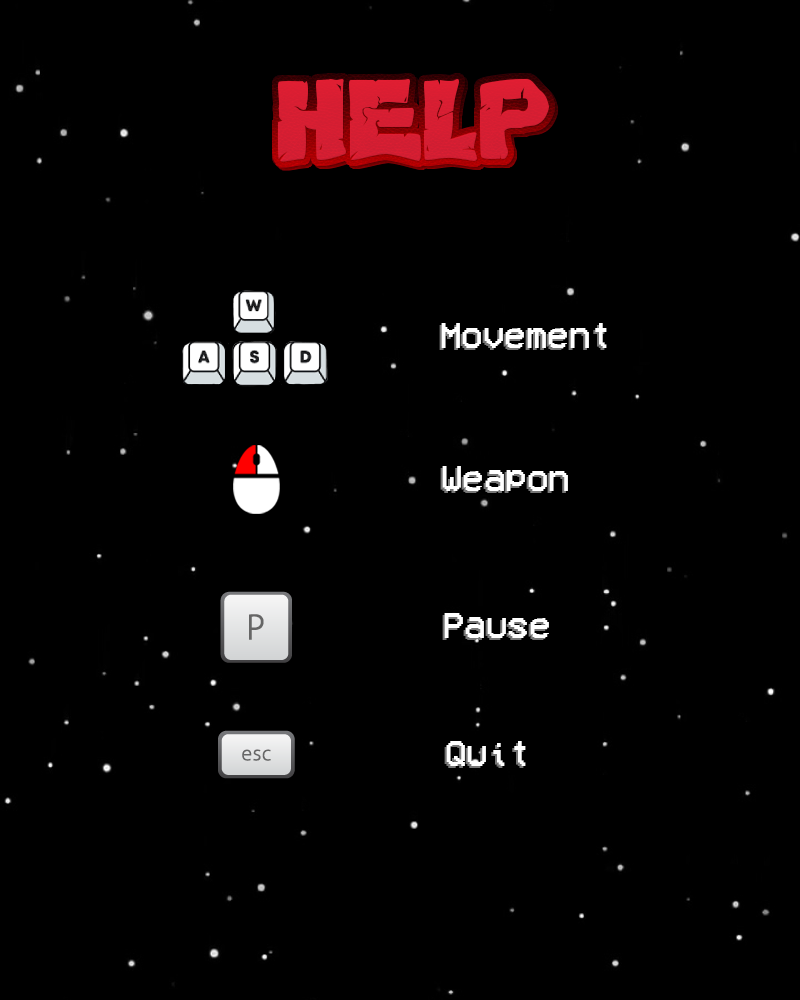

# SPACE-WARS

## Mô tả chung
Game có tên là SPACE WARS, được viết bằng ngôn ngữ C++ và sử dụng thư viện hình ảnh SDL2.

Game nói về cuộc chiến giữa con người và phi thuyền ngoài không gian để bảo vệ Trái Đất khỏi sự xâm lăng của người ngoài hành tinh.

## Hướng dẫn chơi
* `W` `A` `S` `D` để di chuyển 
* Chuột trái để bắn đạn 
* `P` để tạm dừng trò chơi
* `Esc` để thoát game

 
 
 ## Luật chơi
 * Người chơi sẽ có 3 mạng, nếu dính đạn của kẻ địch hoặc va chạm với địch sẽ mất 1 mạng
 * Có 8 wave kẻ địch, wave thứ 8 là boss
 * Người chơi sẽ nhận thêm 1 mạng (không vượt quá 3 mạng) khi bắt đầu đánh boss
 * `GAME OVER` khi người chơi mất hết mạng
 * `YOU WIN` khi người chơi thắng boss
